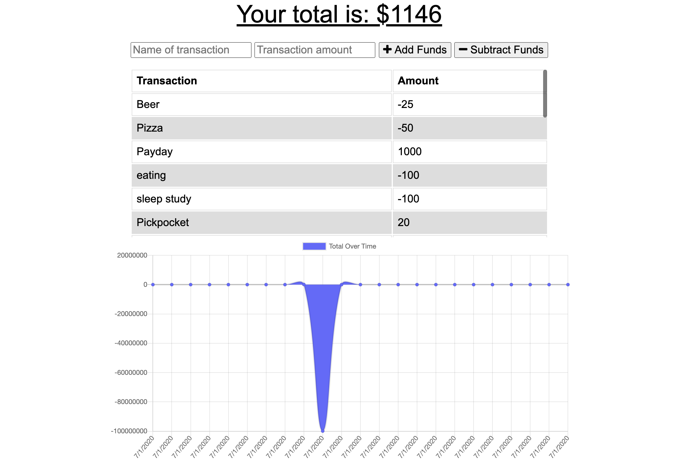
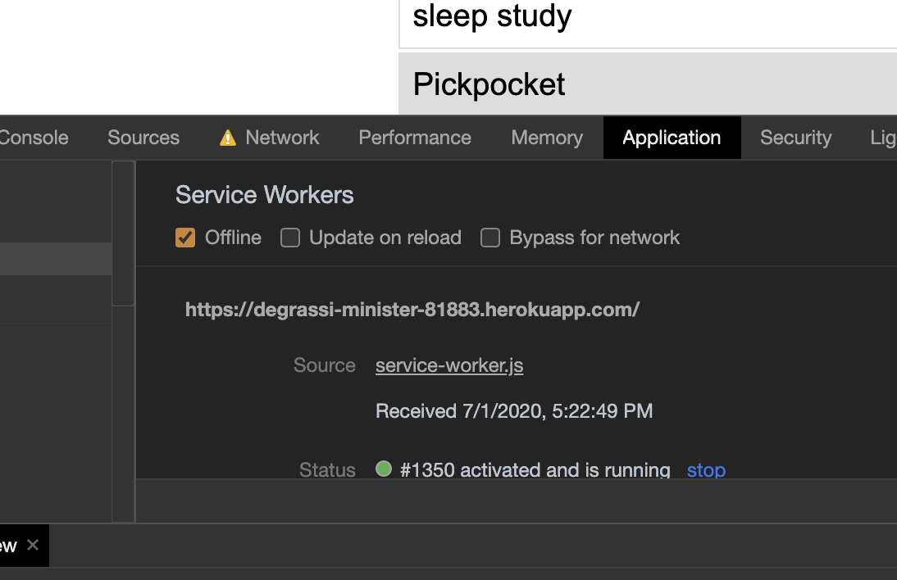

# Progressive_Budget
A budget tracker that works online and off. 

# Progressive_Budget

## Description

This is a budget application that can track a user's inputs while they are on or offline. The app uses IndexedDB, a Manifest, and a Service Worker to cache and store. 

Landing Page

Offline Functionality Page

## Current Version 

v1.0

## Table of Contents

    * Installation
    * Usage
    * License
    * Contributing
    * User GitHub profile picture
    * User GitHub email
                
## Installation

To run, got to https://degrassi-minister-81883.herokuapp.com/

## Usage

This is an open source application.

## License

Public domain  

## Contributing

NA

## Questions

If you have any question please see contact information below. 

## Contact Information

https://github.com/truittj

